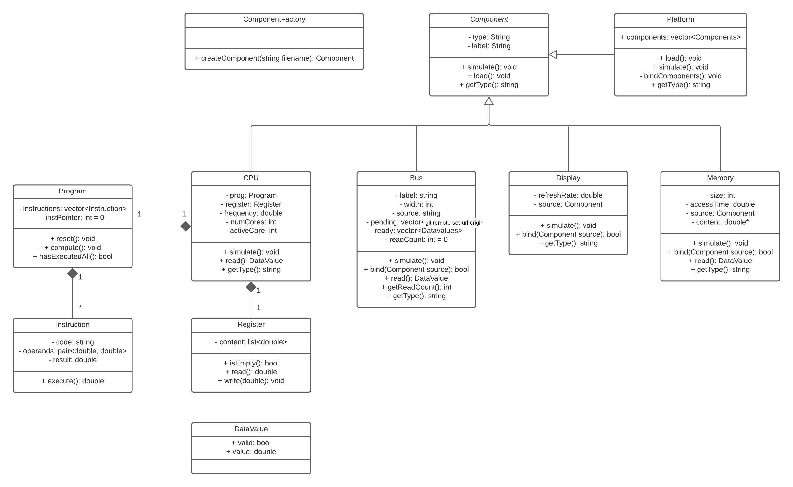

# hardware-platform-simulator
A simplified simulator of hardware components. The simulator loads textual definitions of hardware components, builds a platform with the loaded components and simulates their behavior.

## Week 1
### 04/09/2021 - 11/09/2021

- [x] Class diagram
- [x] Project folder structure
- [x] Read file
  - [x] Separate properties from values
  
### **Class diagram**
The class diagram designed is presented below:



### **Project folder structure**
We use the following organization structure:

```
hardware-platform-simulator/
  bin/ -> executables
  doc/ -> documentation
    img/
  obj/ -> object files
  src/ -> source code
    main.cpp
  test/ -> test files
  .gitignore
  .README.md
```

The namespace organization follows the convetion described in: https://iamsorush.com/posts/namespace-cpp/

## Week 2
### 11/09/2021 - 18/09/2021

- [x] Implement Factory Pattern
  - [x] Call constructor according to component type
- [x] Create recursive Makefile
- [ ] Update Class diagram

### Factory method pattern  
A factory pattern is implemented as a platform method through the use of a map object that takes a type and outputs a Component pointer. This stategy allows the creation of components always with the same line of code:

```cpp
  factoryMap[compType]->makeFromFileContent(content)
```

Where *compType* is a string and content is a map<string, string> with the properties read from the file.

## Week 3
### 18/09/2021 - 25/09/2021

- [x] Create Register
- [x] Create Program class
- [x] Import program file
- [x] Initialize CPU parameters
- [x] Load program to the CPU
- [x] Create Instruction
- [x] Execute instructions from CPU
- [ ] Test file importation
- [ ] Test instructions execution
- [ ] Document functions

### Instruction execute method

### Import methods (importAsDict x importAsVec)
